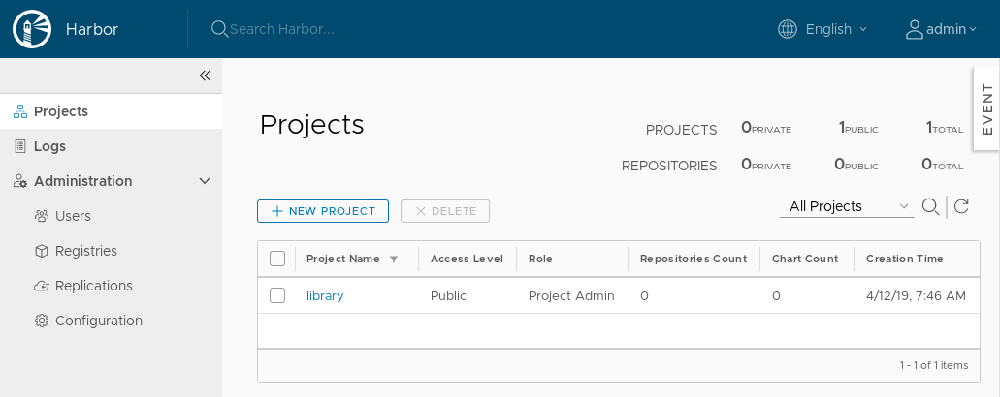

# Install Harbor


## Install Harbor using Helm

Lab architecture:


Label Harbor namespace and copy there the secret with certificates signed by
Let's Encrypt certificate:

```bash
kubectl get namespace harbor-system &> /dev/null || kubectl create namespace harbor-system
kubectl label namespace harbor-system app=kubed
```

Output:

```text
namespace/harbor-system labeled
```

Check if the certificate generated by cert-manager in `cert-manager` namespace
was successfully copied to `harbor-system` namespace:

```bash
kubectl get secrets ingress-cert-${LETSENCRYPT_ENVIRONMENT} -n harbor-system -o json | jq ".metadata | .annotations, .labels"
```

Output:

```json
{
  "certmanager.k8s.io/alt-names": "*.mylabs.dev",
  "certmanager.k8s.io/common-name": "*.mylabs.dev",
  "certmanager.k8s.io/ip-sans": "",
  "certmanager.k8s.io/issuer-kind": "ClusterIssuer",
  "certmanager.k8s.io/issuer-name": "letsencrypt-production-dns",
  "kubed.appscode.com/origin": "{\"namespace\":\"cert-manager\",\"name\":\"ingress-cert-production\",\"uid\":\"c6e141f7-971e-11e9-8672-02d8c8e92542\",\"resourceVersion\":\"17751\"}"
}
{
  "certmanager.k8s.io/certificate-name": "ingress-cert-production",
  "kubed.appscode.com/origin.cluster": "my_k8s_cluster",
  "kubed.appscode.com/origin.name": "ingress-cert-production",
  "kubed.appscode.com/origin.namespace": "cert-manager"
}
```

Add Harbor Helm repository:

```bash
helm repo add harbor https://helm.goharbor.io
```

Output:

```text
"harbor" has been added to your repositories
```

Install Harbor using Helm:

```bash
helm ls | grep harbor || \
helm install --wait --name harbor --namespace harbor-system harbor/harbor --version v1.1.1 \
  --set database.type=external \
  --set database.external.host=pgsql.${MY_DOMAIN} \
  --set database.external.username=harbor_user \
  --set database.external.password=harbor_user_password \
  --set database.external.coreDatabase=harbor-registry \
  --set database.external.clairDatabase=harbor-clair \
  --set database.external.notaryServerDatabase=harbor-notary_server \
  --set database.external.notarySignerDatabase=harbor-notary_signer \
  --set expose.ingress.hosts.core=harbor.${MY_DOMAIN} \
  --set expose.ingress.hosts.notary=notary.${MY_DOMAIN} \
  --set expose.tls.secretName=ingress-cert-${LETSENCRYPT_ENVIRONMENT} \
  --set persistence.enabled=true \
  --set externalURL=https://harbor.${MY_DOMAIN} \
  --set persistence.resourcePolicy=delete \
  --set persistence.persistentVolumeClaim.registry.size=1Gi \
  --set persistence.persistentVolumeClaim.chartmuseum.size=1Gi \
  --set harborAdminPassword=admin
```

Output:

```text
NAME:   harbor
LAST DEPLOYED: Tue Jun 25 11:24:31 2019
NAMESPACE: harbor-system
STATUS: DEPLOYED

RESOURCES:
==> v1/ConfigMap
NAME                         DATA  AGE
harbor-harbor-chartmuseum    23    1s
harbor-harbor-clair          1     1s
harbor-harbor-core           34    1s
harbor-harbor-jobservice     1     1s
harbor-harbor-notary-server  5     1s
harbor-harbor-registry       2     1s

==> v1/Deployment
NAME                         READY  UP-TO-DATE  AVAILABLE  AGE
harbor-harbor-chartmuseum    0/1    1           0          1s
harbor-harbor-clair          0/1    1           0          1s
harbor-harbor-core           0/1    1           0          1s
harbor-harbor-jobservice     0/1    1           0          1s
harbor-harbor-notary-server  0/1    1           0          1s
harbor-harbor-notary-signer  0/1    0           0          1s
harbor-harbor-portal         0/1    0           0          1s
harbor-harbor-registry       0/1    0           0          1s

==> v1/PersistentVolumeClaim
NAME                       STATUS  VOLUME                                    CAPACITY  ACCESS MODES  STORAGECLASS  AGE
harbor-harbor-chartmuseum  Bound   pvc-0afcf35c-972b-11e9-8199-063f437da27c  1Gi       RWO           gp2           1s
harbor-harbor-jobservice   Bound   pvc-0afdc358-972b-11e9-8199-063f437da27c  1Gi       RWO           gp2           1s
harbor-harbor-registry     Bound   pvc-0aff05c7-972b-11e9-8199-063f437da27c  1Gi       RWO           gp2           1s

==> v1/Pod(related)
NAME                                         READY  STATUS             RESTARTS  AGE
harbor-harbor-chartmuseum-d495cf79c-pn2xx    0/1    Pending            0         1s
harbor-harbor-clair-6f46474c5d-2bpl8         0/1    ContainerCreating  0         1s
harbor-harbor-core-5d54dbc867-hb9b9          0/1    ContainerCreating  0         1s
harbor-harbor-jobservice-9944fd86-gc2sc      0/1    Pending            0         1s
harbor-harbor-notary-server-c8f6557cc-rdvfs  0/1    ContainerCreating  0         1s
harbor-harbor-notary-signer-d8f96fd5-4twbh   0/1    ContainerCreating  0         1s
harbor-harbor-portal-76c496bd6c-mpdhp        0/1    ContainerCreating  0         1s
harbor-harbor-redis-0                        0/1    Pending            0         1s
harbor-harbor-registry-54cc857d87-j7rqn      0/2    ContainerCreating  0         1s

==> v1/Secret
NAME                       TYPE    DATA  AGE
harbor-harbor-chartmuseum  Opaque  1     1s
harbor-harbor-core         Opaque  7     1s
harbor-harbor-jobservice   Opaque  1     1s
harbor-harbor-registry     Opaque  2     1s

==> v1/Service
NAME                         TYPE       CLUSTER-IP      EXTERNAL-IP  PORT(S)            AGE
harbor-harbor-chartmuseum    ClusterIP  10.100.105.225  <none>       80/TCP             1s
harbor-harbor-clair          ClusterIP  10.100.176.139  <none>       6060/TCP,6061/TCP  1s
harbor-harbor-core           ClusterIP  10.100.162.127  <none>       80/TCP             1s
harbor-harbor-jobservice     ClusterIP  10.100.119.204  <none>       80/TCP             1s
harbor-harbor-notary-server  ClusterIP  10.100.233.82   <none>       4443/TCP           1s
harbor-harbor-notary-signer  ClusterIP  10.100.3.202    <none>       7899/TCP           1s
harbor-harbor-portal         ClusterIP  10.100.232.228  <none>       80/TCP             1s
harbor-harbor-redis          ClusterIP  10.100.48.79    <none>       6379/TCP           1s
harbor-harbor-registry       ClusterIP  10.100.153.160  <none>       5000/TCP,8080/TCP  1s

==> v1/StatefulSet
NAME                 READY  AGE
harbor-harbor-redis  0/1    1s

==> v1beta1/Ingress
NAME                   HOSTS                                ADDRESS  PORTS  AGE
harbor-harbor-ingress  harbor.mylabs.dev,notary.mylabs.dev  80, 443  1s


NOTES:
Please wait for several minutes for Harbor deployment to complete.
Then you should be able to visit the Harbor portal at https://harbor.mylabs.dev.
For more details, please visit https://github.com/goharbor/harbor.
```

Harbor architecture:


Check how the Harbor Ingress looks like:

```bash
kubectl describe ingresses -n harbor-system harbor-harbor-ingress
```

Output:

```text
Name:             harbor-harbor-ingress
Namespace:        harbor-system
Address:          18.196.144.15
Default backend:  default-http-backend:80 (<none>)
TLS:
  ingress-cert-production terminates harbor.mylabs.dev
  ingress-cert-production terminates notary.mylabs.dev
Rules:
  Host               Path  Backends
  ----               ----  --------
  harbor.mylabs.dev
                     /             harbor-harbor-portal:80 (192.168.58.78:80)
                     /api/         harbor-harbor-core:80 (192.168.19.87:8080)
                     /service/     harbor-harbor-core:80 (192.168.19.87:8080)
                     /v2/          harbor-harbor-core:80 (192.168.19.87:8080)
                     /chartrepo/   harbor-harbor-core:80 (192.168.19.87:8080)
                     /c/           harbor-harbor-core:80 (192.168.19.87:8080)
  notary.mylabs.dev
                     /   harbor-harbor-notary-server:4443 (192.168.22.110:4443)
Annotations:
  ingress.kubernetes.io/proxy-body-size:        0
  ingress.kubernetes.io/ssl-redirect:           true
  nginx.ingress.kubernetes.io/proxy-body-size:  0
  nginx.ingress.kubernetes.io/ssl-redirect:     true
Events:
  Type    Reason  Age    From                      Message
  ----    ------  ----   ----                      -------
  Normal  CREATE  6m56s  nginx-ingress-controller  Ingress harbor-system/harbor-harbor-ingress
  Normal  UPDATE  6m56s  nginx-ingress-controller  Ingress harbor-system/harbor-harbor-ingress
```

Open the [https://harbor.mylabs.dev](https://harbor.mylabs.dev):


Log in:

* User: `admin`
* Password: `admin`

You should see the Web UI:


