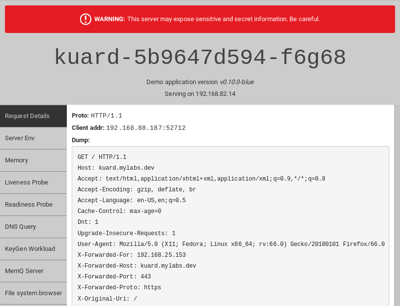

# Project settings

There are few project settings which are handy...

## Automatically scan images on push

Enable automated vulnerability scan after each "image push" to the project:
`library`:

```bash
PROJECT_ID=$(curl -s -u "aduser05:admin" -X GET "https://core.${MY_DOMAIN}/api/projects?name=library" | jq ".[].project_id")
curl -s -u "aduser05:admin" -X PUT "https://core.${MY_DOMAIN}/api/projects/${PROJECT_ID}" -H  "Content-Type: application/json" \
-d "{ \"metadata\": { \"auto_scan\": \"true\" } }"
```

You should see the following in the Web interface:


Tag the image:

```bash
docker tag nginx:1.13.12 core.${MY_DOMAIN}/library/nginx:1.13.12
```

Push the container image to Harbor project `library`:

```bash
docker push core.${MY_DOMAIN}/library/nginx:1.13.12
```

All images in that repositories should be automatically checked for
vulnerabilities.

## Prevent vulnerable images from running

Now there are two container images in the `library` repository:

* `nginx:1.13.12` - which has many vulnerabilities
* `kuard:blue` - which has no vulnerabilities

Turn on the "Prevent vulnerable images from running" feature:

```bash
PROJECT_ID=$(curl -s -u "aduser05:admin" -X GET "https://core.${MY_DOMAIN}/api/projects?name=library" | jq ".[].project_id")
curl -s -u "aduser05:admin" -X PUT "https://core.${MY_DOMAIN}/api/projects/${PROJECT_ID}" -H  "Content-Type: application/json" \
-d "{ \"metadata\": { \"prevent_vul\": \"true\", \"severity\": \"high\" } }"
```


## Use image hosted by Harbor in k8s deployment

Create `kuard` deployment and expose it:

```bash
kubectl create namespace mytest
kubectl run kuard --image=core.${MY_DOMAIN}/library/kuard-amd64:blue --replicas=2 --port=8080 --expose=true --labels="app=kuard" -n mytest
```

Create Ingress for kuard service:

```bash
envsubst < ../files/kuard_ingress.yaml | kubectl create -f -
```

You should be able to access kuard at [https://kuard.mylabs.dev](https://kuard.mylabs.dev)
and see this:



Try the same with `nginx:1.13.12` image:

```bash
kubectl run nginx --image=core.${MY_DOMAIN}/library/nginx:1.13.12 --replicas=2 --port=80 --expose=true --labels="app=nginx" -n mytest
```

Output:

```text
service/nginx created
deployment.apps/nginx created
```

If you check the pods you will see they are not running:

```bash
kubectl -n mytest get pods --selector=app=nginx
```

Output:

```text
NAME                     READY   STATUS             RESTARTS   AGE
nginx-7c58bbb988-9bsz5   0/1     ImagePullBackOff   0          89s
nginx-7c58bbb988-g8k6m   0/1     ImagePullBackOff   0          89s
```

The details of one of the pods looks like:

```bash
POD_NAME=$(kubectl -n mytest get pods --selector=app=nginx -o jsonpath='{.items[0].metadata.name}')
kubectl -n mytest describe pod $POD_NAME
```

Output:

```text
Name:               nginx-7c58bbb988-9bsz5
Namespace:          mytest
Priority:           0
PriorityClassName:  <none>
Node:               ip-192-168-73-66.eu-central-1.compute.internal/192.168.73.66
Start Time:         Mon, 13 May 2019 13:33:05 +0200
Labels:             app=nginx
                    pod-template-hash=7c58bbb988
Annotations:        <none>
Status:             Pending
IP:                 192.168.82.14
Controlled By:      ReplicaSet/nginx-7c58bbb988
Containers:
  nginx:
    Container ID:
    Image:          core.mylabs.dev/library/nginx:1.13.12
    Image ID:
    Port:           80/TCP
    Host Port:      0/TCP
    State:          Waiting
      Reason:       ImagePullBackOff
    Ready:          False
    Restart Count:  0
    Environment:    <none>
    Mounts:
      /var/run/secrets/kubernetes.io/serviceaccount from default-token-zcf84 (ro)
Conditions:
  Type              Status
  Initialized       True
  Ready             False
  ContainersReady   False
  PodScheduled      True
Volumes:
  default-token-zcf84:
    Type:        Secret (a volume populated by a Secret)
    SecretName:  default-token-zcf84
    Optional:    false
QoS Class:       BestEffort
Node-Selectors:  <none>
Tolerations:     node.kubernetes.io/not-ready:NoExecute for 300s
                 node.kubernetes.io/unreachable:NoExecute for 300s
Events:
  Type     Reason     Age                   From                                                     Message
  ----     ------     ----                  ----                                                     -------
  Normal   Scheduled  10m                   default-scheduler                                        Successfully assigned mytest/nginx-7c58bbb988-9bsz5 to ip-192-168-73-66.eu-central-1.compute.internal
  Normal   Pulling    9m16s (x4 over 10m)   kubelet, ip-192-168-73-66.eu-central-1.compute.internal  pulling image "core.mylabs.dev/library/nginx:1.13.12"
  Warning  Failed     9m16s (x4 over 10m)   kubelet, ip-192-168-73-66.eu-central-1.compute.internal  Failed to pull image "core.mylabs.dev/library/nginx:1.13.12": rpc error: code = Unknown desc = Error response from daemon: unknown: The severity of vulnerability of the image: "high" is equal or higher than the threshold in project setting: "high".
  Warning  Failed     9m16s (x4 over 10m)   kubelet, ip-192-168-73-66.eu-central-1.compute.internal  Error: ErrImagePull
  Warning  Failed     5m38s (x21 over 10m)  kubelet, ip-192-168-73-66.eu-central-1.compute.internal  Error: ImagePullBackOff
  Normal   BackOff    27s (x44 over 10m)    kubelet, ip-192-168-73-66.eu-central-1.compute.internal  Back-off pulling image "core.mylabs.dev/library/nginx:1.13.12"
```

You are not able to run docker images with "High" security issues.
